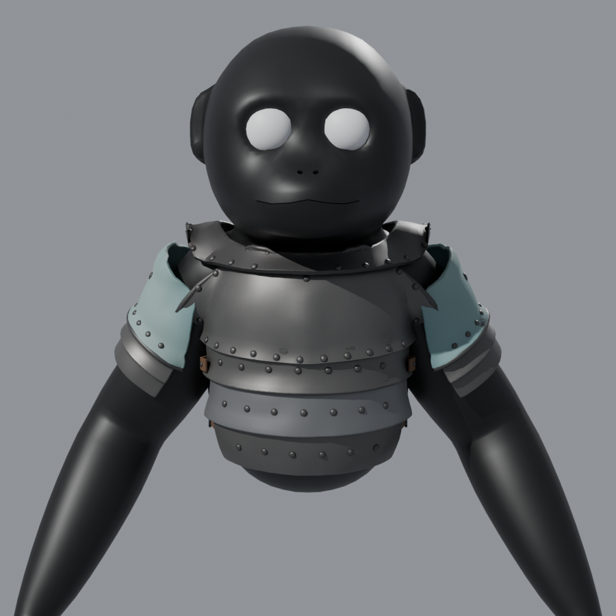

# Scrap-metal chest plate (PeeperLeeper)

Bolted-together scrap-metal chest armor (clean steel by default — set `RUST` in the script to add rust back), fitted to `../PeeperLeeper.fbx` and skinned to its rig.



## Files

| File | What it is |
| --- | --- |
| `ChestPlate.fbx` | Armor rigged to the PeeperLeeper armature, **one object per part**. Textures are embedded. |
| `ChestPlate_Merged.fbx` | The same armor as a single skinned mesh, for engines or cosmetics that want one mesh. |
| `ChestPlate.blend` | Editable scene with the player model, the armor, the atlas material and the procedural source materials (`Proc_*`). |
| `textures/` | 1024² atlas: BaseColor, Roughness, Metallic, Normal (OpenGL / Blender style), plus `MetallicSmoothness` for Unity's Standard shader. |
| `build_chestplate.py` | The generator. Change the numbers in its SETTINGS block and re-run to rebuild everything. |

## Parts (every one is its own object)

Breastplate, Backplate, BellyLame_1-3, Gorget, PauldronCap.L/R, PauldronLame_1-2.L/R,
Strap_1-2.L/R, Buckle_1-2.L/R, plus separate objects for the rivets, bolts,
rolled rims and weld beads (`Rivets_*`, `Bolts_*`, `Rim_*`, `Weld_*`). The welded crack and the hazard-striped scrap patch are off by default; set `CRACK_WELD["enabled"]` or `SCRAP_PATCH["enabled"]` to `True` to bring them back. You can delete, move or remodel any part on its own.

All parts share one material (`ChestPlate_Atlas`), so the whole set is a single draw call.

## Fit and rig

- The plates were fitted by ray-casting against the real body in its T-pose rest shape, with a small gap so nothing clips.
- Weights are copied from the nearest body vertices. Torso parts use Hips, Spine and Chest, the gorget uses Chest, and the pauldrons use Shoulder, Upperarm and Chest. The armor follows the body in any pose.
- Bone names match the player rig exactly, so in Unity or another engine you can bind it to the character's existing skeleton.

## Editing

**By hand:** open `ChestPlate.blend`, select a part, then press Tab to edit it. Keep the Armature modifier on each part so it still deforms.
To repaint, edit the textures in `textures/`, or change the `Proc_*` materials and re-bake them.

**By settings:** open `build_chestplate.py` and edit the SETTINGS block. You can change the gap from the body
(`CLEARANCE`), plate thickness, dent count and depth, rivet size and spacing, neckline shape, plate coverage,
belly lame count, rust amount (`RUST`, 0 = clean), pauldron size and dome height, strap heights, scrap patch (on/off and position), the crack weld (on/off and path) and the random `SEED`. Then run:

```sh
blender --background --python build_chestplate.py
# or, with the bpy pip package (pip install bpy):
python3 build_chestplate.py
```

A rebuild takes about 3 minutes, most of it the texture bake. Set `RENDER_PREVIEWS = False` to skip the preview renders.
