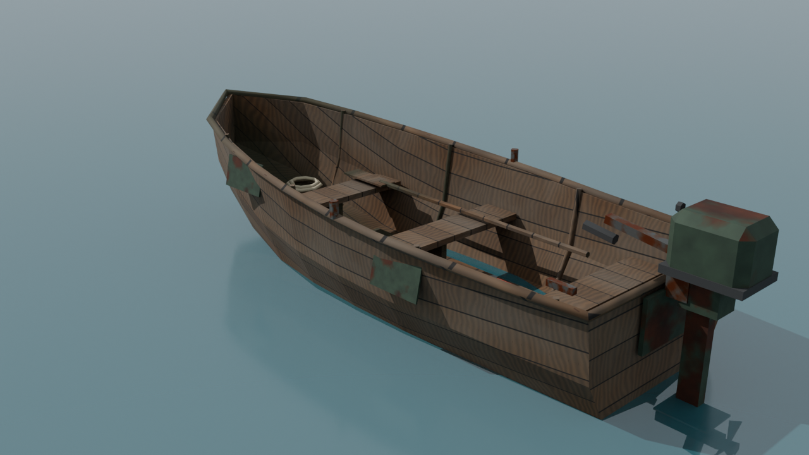

# Drivable survival boat (FBX)

A low-poly, beat-up wooden motor skiff in the style of Rust's rowboat / Stranded Deep's small boats:
plank hull with patched-up rusty plates, three benches, oars, a fuel can, rope, and a
chipped army-green tiller outboard.



| File | What |
|---|---|
| `Boat.fbx` | The model, textures embedded (Unity / Unreal / Roblox / Godot) |
| `Boat.glb` | Same model as glTF (web / three.js / Godot) |
| `Boat.blend` | Blender source |
| `textures/` | 1024² wood, rusty-paint and bare-metal textures |
| `Unity/BoatController.cs` | Buoyancy + driving + enter/exit script |
| `build_boat.py` | Regenerates everything (`pip install bpy && python3 build_boat.py`) |
| `render_preview.py` | Re-renders the preview images |

**Specs:** ~4.5 m long, 1.7 m beam, ~1.4k triangles (low poly, flat shaded), real-world metres, Y-up, bow faces +Z in Unity.

## Hierarchy (the parts that make it drivable)

```
Boat                      root, put the Rigidbody + BoatController here
├─ Hull, Gunwale, Seat_*, Rib_*, Oar_*, Fuel_Can, Patch_* ...   (static meshes)
├─ Motor_Pivot            rotate around up to steer the outboard
│  ├─ Motor_Cowling, Motor_Leg, Motor_Tiller ...
│  ├─ Propeller           spin around the boat's forward axis
│  └─ FX_Prop_Wash        spawn wake / splash particles here
├─ Sockets
│  ├─ Seat_Driver, Seat_Passenger_1, Seat_Passenger_2
│  ├─ Exit_Left, Exit_Right
│  └─ Float_FL, Float_FR, Float_RL, Float_RR, Float_Center   buoyancy sample points
└─ Boat_Collider          simple convex hull, use as a MeshCollider (convex) and hide it
```

## Unity quick start

1. Drag `Boat.fbx` into `Assets/`. In the import settings, Materials tab → **Extract Textures** if materials show up white.
2. Put the boat in the scene, add a **Rigidbody** (mass ~350) and **BoatController** to the root.
3. On `Boat_Collider` add a **MeshCollider** with *Convex* ticked.
4. Drag your player into the `Player` field and set `Water Level` to your ocean height.
5. Play: walk up, **E** to get in/out, **W/S** throttle, **A/D** steer, **Space** cuts the engine.

For waves, subclass `BoatController` and override `GetWaterHeight(worldPos)`.
On Unity versions before 6, rename `linearDamping/angularDamping/linearVelocity` to `drag/angularDrag/velocity`.

**Unreal:** rename `Boat_Collider` to `UCX_Hull` before import to get it as auto collision.
**Roblox:** import via 3D Importer; anchor nothing, use `Motor_Pivot`/`Propeller` as the parts to animate and drive it with a `VehicleSeat` at `Seat_Driver`.
