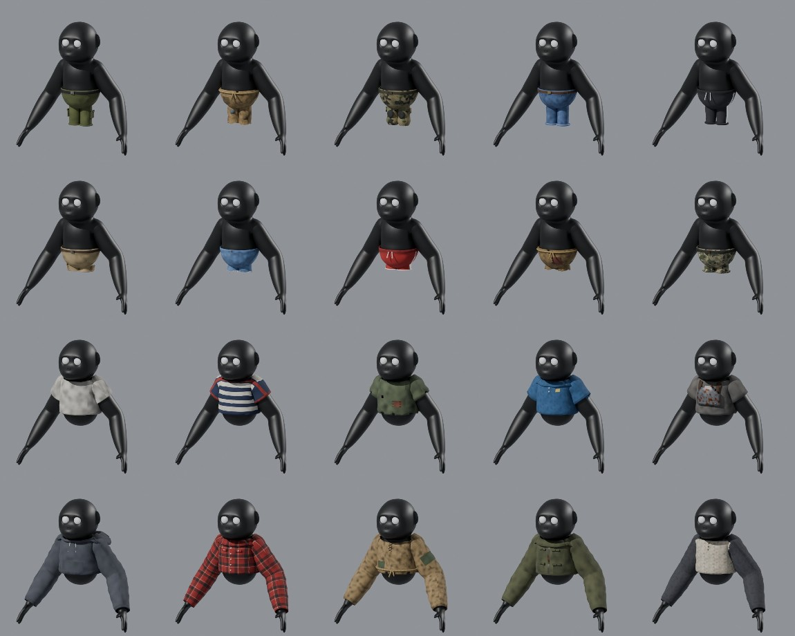

# PeeperLeeper clothing pack

20 survival-style clothing pieces (Rust / Stray-VR vibe) fitted to
`PlayerModel/PeeperLeeper.fbx`, the legless, long-armed monkey player.



Rows: **Pants**, **Shorts**, **Shirts** (short sleeve), **Long sleeves**.

| Pants | Shorts | Shirts | Long sleeves |
| --- | --- | --- | --- |
| Cargo Pants | Cargo Shorts | Basic Tee | Hoodie |
| Burlap Trousers | Ripped Jorts | Striped Ringer Tee | Flannel Shirt |
| Camo Pants | Athletic Shorts | Survivor Tee (torn, patched) | Burlap Shirt |
| Denim Jeans | Burlap Shorts | Polo Shirt | Field Jacket |
| Track Pants | Camo Shorts | Scrap Armor Tee | Thermal Henley |

## Files per piece

Each piece's folder (for example `Pants/01_CargoPants/`) holds:

| File | Contents |
| --- | --- |
| `<Name>_WithPlayer.fbx` | Player body + eyes + rig + the garment, all skinned and ready to drop in |
| `<Name>_ClothOnly.fbx` | Rig + the garment only. Put it under your existing player rig, or bind it to the same bones |
| `<Name>_preview.jpg` | Front and back render of the piece worn in the model's default pose |

- **Rig:** every garment is weighted to the same 29-bone `Armature` as the player, with
  identical bone names, so it moves with the player's animations. The "ClothOnly" files still
  include the armature because a skinned mesh needs bones to bind to. In Unity you can
  point the cloth's SkinnedMeshRenderer at the player's existing bones, or just use the
  WithPlayer file.
- **Textures** are embedded in each FBX and also included as JPEGs in `Textures/`.
- **Layering:** bottoms sit tight (about 0.012 out from the body) and tops sit further out
  (about 0.045). Any shirt can be worn over any pants or shorts without clipping, and the
  shirt hem overlaps the waistband.
- **Legs:** the player model has no legs, so trousers and shorts get hanging fabric legs
  below the body (long for pants, short for shorts). Their tops tuck inside the body and
  they are weighted to `Hips`.
- Triangle budget: about 1.7k–3.4k faces for bottoms and short-sleeve tops, about 5–6k for long sleeves.

## Regenerating / making more

Everything is generated by a script, so you can tweak colours, lengths and fit and
rebuild:

```sh
pip install bpy                     # Blender as a Python module
python3 tools/build_all.py PlayerModel/PeeperLeeper.fbx .            # all 20
python3 tools/build_all.py PlayerModel/PeeperLeeper.fbx . hoodie     # just one
python3 tools/contact_sheet.py . overview.jpg
```

Each garment is a short function in `tools/build_all.py`. For example, `cargo_pants` lists
its materials, cuts, pockets and belt, so new pieces are mostly copy-and-edit work. The
geometry helpers live in `tools/clothing_lib.py`.
