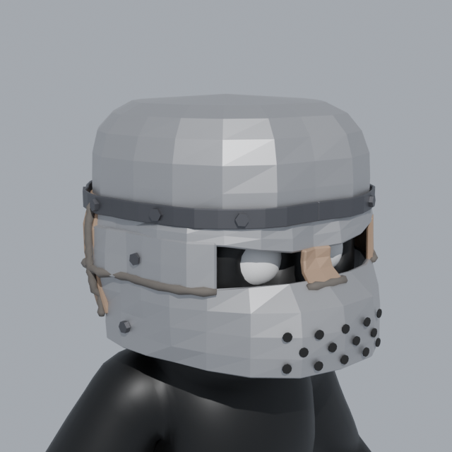

# Rust-style Metal Helmet (fits PeeperLeeper)

A welded scrap-metal bucket helm that covers the whole face, with angled eye slits, a breathing-hole jaw plate, weld beads and bolts.



| File | What it is |
|---|---|
| `PeeperLeeper_MetalHelmet.fbx` | Player + helmet, already attached to the **Head** bone. Easiest: just use this as your player model. |
| `MetalHelmet.fbx` | Helmet only (for a cosmetic/hat system). |
| `MetalHelmet.blend` | Editable source. Includes the player for reference. Modifiers are still live. |
| `make_helmet.py` | Generator: change the numbers in `P` and run it again to rebuild everything. |

## Parts (each one is a separate object you can edit or delete)

All parts are children of the empty `MetalHelmet`:

- `Helmet_Dome`: the top of the bucket
- `Helmet_Band`: the strap around the seam
- `Helmet_BrowPlate`: the forehead plate; its bottom edge is the top of the eye slits
- `Helmet_NoseBridge`
- `Helmet_CheekPlate_L` / `Helmet_CheekPlate_R`
- `Helmet_JawPlate`: wraps the muzzle
- `Helmet_BreathingHoles`
- `Helmet_BackPlate`
- `Helmet_Welds`
- `Helmet_Bolts`

Materials: `Helmet_Steel`, `Helmet_RustSteel`, `Helmet_DarkSteel`, `Helmet_Weld`, `Helmet_Holes`.
Every part has UVs, so you can paint rust or scratch textures onto it.

Fit: the plates are shaped by ray-casting the player's head, and every vertex is checked against the player mesh.
Nothing pokes through, and the closest point is about 12 mm from the head or muzzle.
Your player's eyes show through the slits.

To reshape the helmet, edit `P` in `make_helmet.py` and run it again. For example:
`SLIT_BOT_Z` / `BROW_INNER_Z` / `BROW_OUTER_Z` move the eye slits, `TOP_Z` sets the height,
`CLEAR` sets how loose it fits, `DENT` sets how dented the metal looks, and the colors are at the bottom of `P`.

## Unity
- **Option A:** drop `PeeperLeeper_MetalHelmet.fbx` in and use it in place of the old player model.
  The helmet is already under `Armature/Hips/Spine/Chest/Neck/Head`, so it follows the head.
- **Option B (cosmetic):** import `MetalHelmet.fbx` with the same import settings as your player.
  Put both at the same position with the player in its rest pose, then drag `MetalHelmet` onto the
  `Head` bone and keep its world position. Save it as a prefab, and toggle it on and off as a cosmetic.
- To turn off a single piece (for example, no nose guard), disable that child object.
- The materials import as Standard/Lit. Set Metallic to about 0.9 and Smoothness to about 0.4 for a worn metal look.

## Regenerate
```
pip install bpy==4.2.0      # or use a Blender 4.x install
python3 make_helmet.py path/to/PeeperLeeper.fbx . --render
# or: blender --background --python make_helmet.py -- path/to/PeeperLeeper.fbx . --render
```
