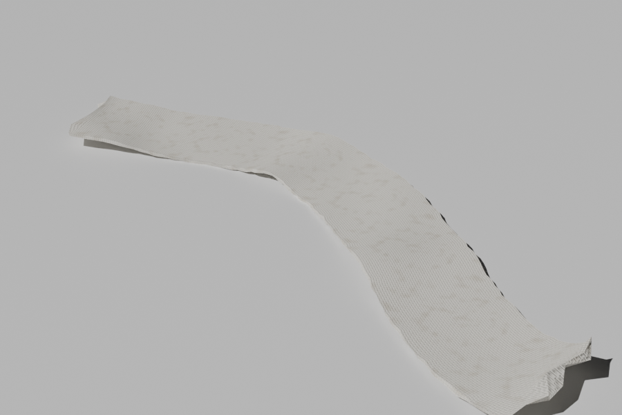

# Bandage model

A single loose cloth bandage strip lying on the ground, with soft wrinkles, a curled end and frayed cut ends, in the style of the bandages in Rust and Strayed VR.

| File | What it is |
|---|---|
| `bandage.fbx` | The model, with both textures embedded (FBX 7.4, binary). Works in Unity, Unreal and Blender. |
| `textures/bandage_albedo.png` | 1024² tileable gauze colour map (off-white with light dirt) |
| `textures/bandage_normal.png` | 1024² tangent-space normal map (OpenGL / +Y) |
| `bandage.blend` | Blender source file |
| `build_bandage.py` | Script that generates everything above |

- About 2.5k triangles, 1.3k vertices, one mesh, one material (`M_Bandage`).
- Real-world size: a 30 × 5 cm strip, about 32 × 12 × 1.5 cm including the S-bend (1 unit = 1 m). The pivot sits on the ground at the middle of the strip.
- The UVs repeat the texture every 5 cm along the strip, so leave texture wrap on **Repeat**.
- **Unreal:** tick *Flip Green Channel* on the normal map, because Unreal expects DirectX-style normal maps.

To change the length, width, bend or wrinkles, edit the constants at the top of
`build_bandage.py` and run `pip install bpy numpy && python3 build_bandage.py`.
