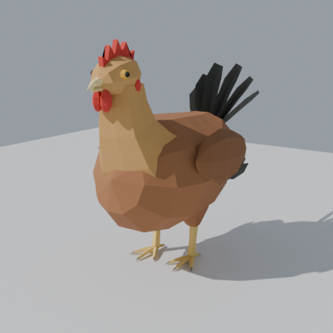

# Low-poly chicken

Flat-shaded, low-poly hen in a survival-game style (Rust-style wildlife): russet body,
golden neck hackles, black tail fan and flight feathers, serrated red comb, wattles,
amber eyes, jointed yellow legs with claws.

- `chicken.fbx`: ready to drop into Unity / Unreal / Godot
- `chicken.blend`: Blender source
- `build_chicken.py`: script that generates both (`pip install bpy` then `python3 build_chicken.py`)

| | |
|---|---|
| Size | ~2.75 m tall (`SCALE = 5.0` at the top of the script; 1.0 gives a real-size ~0.55 m hen) |
| Polycount | ~1,670 tris |
| Parts | 17 separate meshes: Body, Neck, Head, Beak, Comb, Wattle, Eye.L/R, Tail, Wing.L/R, Thigh.L/R, Shank.L/R, Foot.L/R |
| Materials | 10 solid colours (`PALETTE` in the script) |
| Rig | Root, Body, Neck1, Neck2, Head, Tail, Wing.L/R, Thigh.L/R, Shank.L/R, Foot.L/R |
| Animations @ 30 fps | `Idle` (73f), `Walk` (25f loop), `Run` (17f loop), `Peck` (31f), `Flap` (25f), `Death` (41f) |

Exported with forward `-Z` and up `Y`, so in Unity the chicken faces `+Z`.

## Editing parts

Every part is its own object (origin at its centre) parented to `ChickenRig` with an Armature
modifier and vertex groups for its bones. Select any part in Blender to move, scale or reshape
it in Edit Mode; geometry you extrude or duplicate inherits the vertex groups, so it keeps
following the rig. To move a part to a different bone, rename its vertex group to that bone's
name. Re-export with File > Export > FBX (Armature + Mesh, "Add Leaf Bones" off).

Change the colours in `PALETTE` and re-run the script to make a white or black chicken.
