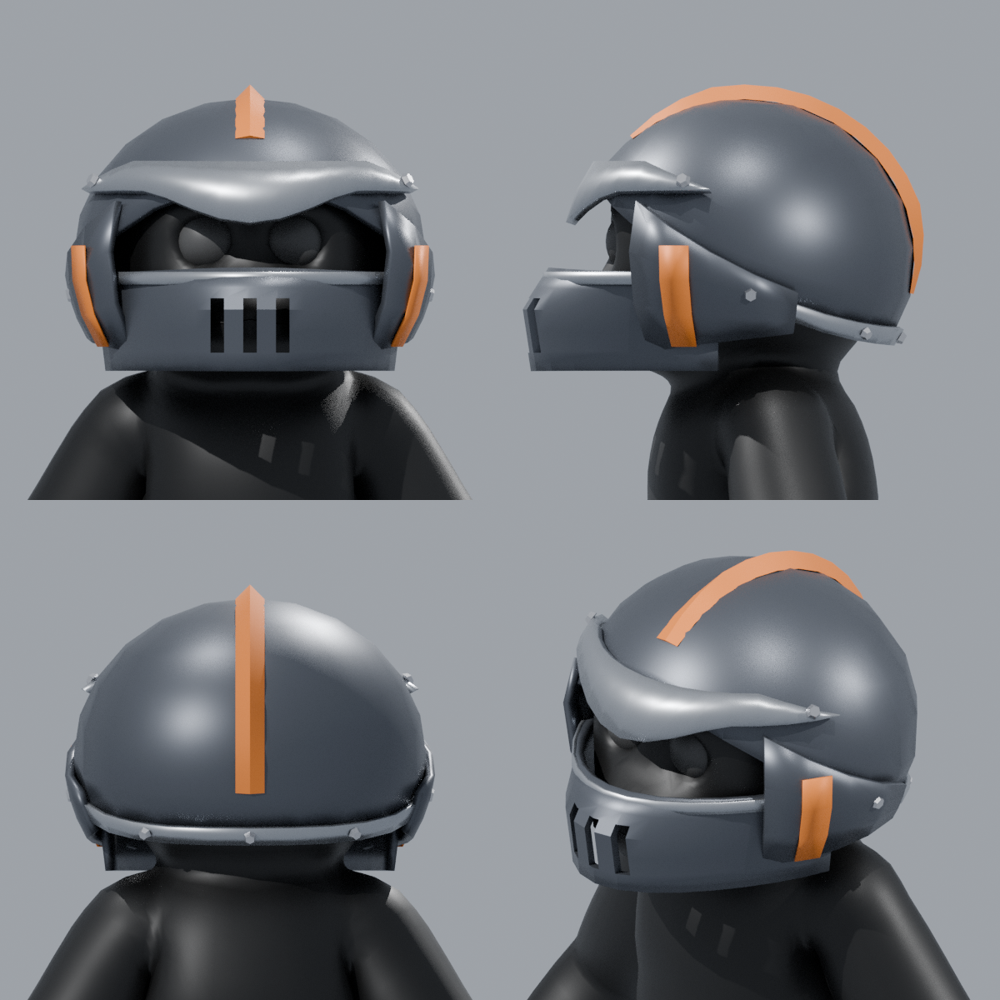

# Combat Helm for PeeperLeeper

A stylized, low-poly metal combat helm made to match PeeperLeeper's Gorilla Tag–style look.
It uses clean solid colours with no realistic textures, fits snugly, and has an angry slanted brow.



| File | What it is |
| --- | --- |
| `CombatHelm.fbx` | The helmet only. Every part is its own object, already positioned for PeeperLeeper. |
| `PeeperLeeper_CombatHelm.fbx` | The character with the helmet attached to the `Head` bone, so it moves with the head. |
| `CombatHelm.blend` | Editable Blender source, with modifiers (thickness, grill-slot cutouts) still live. |
| `build_combat_helm.py` | The script that generates all of the above. |

## Parts (under the `CombatHelm` empty)

- **Shell**: `Dome`, `Rim_Trim`
- **Face**: `Brow_Plate`, `Muzzle_Guard` (grill slots), `Muzzle_Lip`, `Cheek_Guard_L/R`, `Cheek_Stripe_L/R`
- **Crest**: `Crest`
- **Bolts**: one object per bolt

Materials are plain colours, so they're easy to recolour in Unity or Blender: `Gunmetal`, `Steel_Trim`,
`Rust_Orange` (the accent) and `Bolt`. The helmet is about 2k triangles, which is light enough for Quest.

To move or resize the grill slots, edit the wireframe `Cutter_Grill_*` objects in the `.blend`.

## Regenerating

The shape is set by the numbers at the top of `build_combat_helm.py`: `SEG` sets how chunky the dome is,
`BROW_LOW/HIGH` sets how angry the brow looks, and `RX/RY/RZ` set the size. After the build, the script
prints a fit check.

```sh
pip install bpy
python build_combat_helm.py PeeperLeeper.fbx
```
