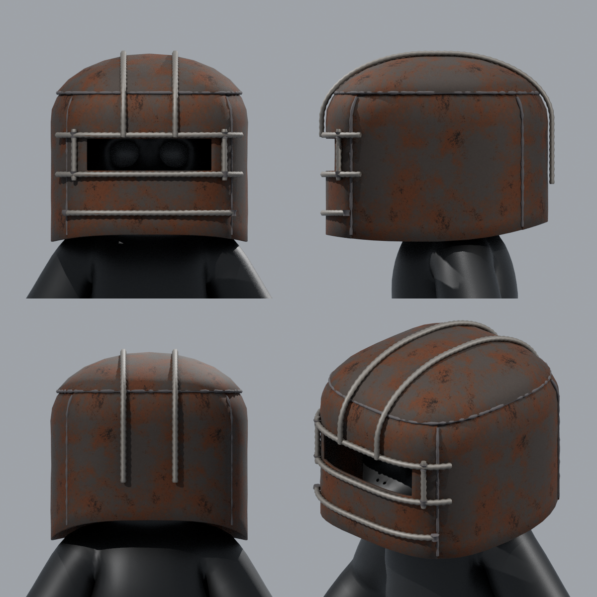

# Heavy Helm for PeeperLeeper

A Rust-style heavy plate helm (a tall, round-topped welded bucket with a rebar-framed eye slit),
sized to fit `PeeperLeeper.fbx`.



| File | What it is |
| --- | --- |
| `HeavyHelm.fbx` | The helmet only. Every part is its own object, already positioned for PeeperLeeper. |
| `PeeperLeeper_HeavyHelm.fbx` | The character with the helmet attached to the `Head` bone, so it moves with the head. |
| `HeavyHelm.blend` | Editable Blender source, with modifiers and the eye-slit cutter still live and textures packed. |
| `textures/` | The rust textures (512 px). They are also embedded in both FBX files. |
| `build_heavy_helm.py` | The script that generates all of the above. |

## Parts (under the `HeavyHelm` empty)

- **Plates**: `Plate_Top`, `Plate_Front` (eye slit), `Plate_Back`, `Plate_Side_L`, `Plate_Side_R`
- **Rebar**: `Bar_Brow`, `Bar_Cheek`, `Bar_Chin`, `Bar_SlitEnd_L/R`, `Bar_Crown_L/R` (these run over the top)
- **Welds**: `Weld_Top_Seam`, 4 side seams, and weld blobs where the bars attach

Materials: `Rusted_Plate`, `Rebar`, `Weld_Bead`. The helmet is about 14k triangles.

To resize the eye slit, edit the wireframe `Cutter_EyeSlit` object in the `.blend`.

## Regenerating

The shape is set at the top of `build_heavy_helm.py`: `AX/AY` set the width and depth, `SQUARE` sets how
boxy it is, `ZC/RZ` set the height and roundness of the top, `bottom_z` sets the lower edge, and `SLIT_*`
sets the eye slit. After the build, the script prints a fit check.

```sh
pip install bpy
python build_heavy_helm.py PeeperLeeper.fbx
```
