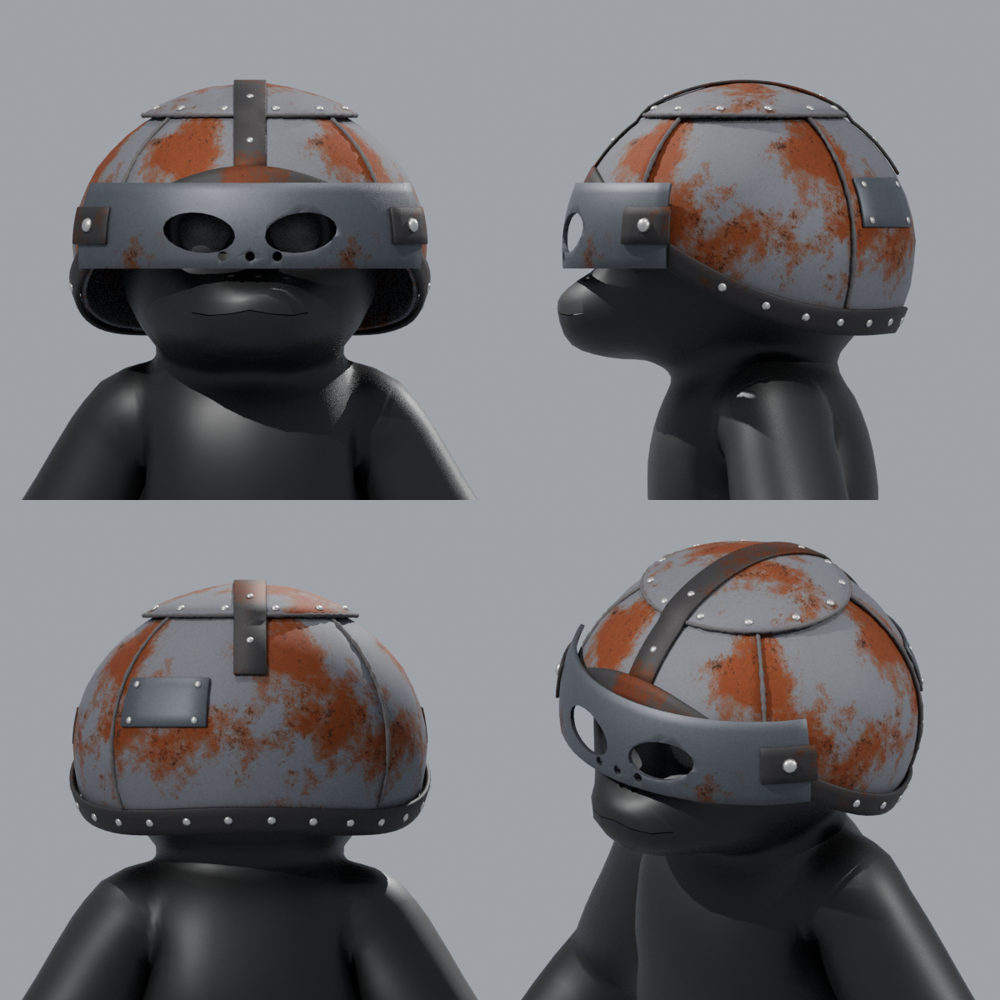

# Metal Helmet for PeeperLeeper

A Rust / Strayed-style scrap-metal helmet built to fit `PeeperLeeper.fbx`.



| File | What it is |
| --- | --- |
| `MetalHelmet.fbx` | The helmet only. Every part is its own object, already positioned for PeeperLeeper (same origin and scale). |
| `PeeperLeeper_MetalHelmet.fbx` | The character with the helmet attached to the `Head` bone, so it moves with the head. |
| `MetalHelmet.blend` | Editable Blender source. Modifiers are still live (thickness, bevel, eye-hole cutouts) and textures are packed. |
| `textures/` | The rust textures (512 px, tileable). They are also embedded in both FBX files. |
| `build_helmet.py` | The script that generates all of the above. |

## Parts

Each part is a separate object, grouped under empties inside `MetalHelmet`:

- **Plates**: `Plate_Crown`, `Plate_Front`, `Plate_Back`, `Plate_Side_L`, `Plate_Side_R`, `Crown_Strip`
- **Rim**: `Rim_Band`
- **Faceplate_Parts**: `Faceplate` (eye slots and vents), `Hinge_Plate_L/R`, `Hinge_Bolt_L/R`
- **Welds**: `Weld_Front_L/R`, `Weld_Back_L/R`, `Weld_Crown_Ring`
- **Rivets_Rim**, **Rivets_Crown**: one object per rivet
- **Scrap_Patch_Parts**: `Scrap_Patch` plus its 4 rivets

To remove the face mask, delete `Faceplate_Parts`. To move or reshape the eye holes, open the
`.blend` and edit the wireframe `Cutter_EyeSlot_L/R` and `Cutter_Vent_*` objects in the
"Cutters" collection.

Materials: `Rusty_Plate`, `Scrap_Steel`, `Iron_Band`, `Weld_Bead`, `Rivet`.
The helmet is about 17.5k triangles in total.

## Regenerating

The fit is set by the numbers at the top of `build_helmet.py` (`C`, `RX/RY/RZ`, `rim_v`).
After the build, the script prints a fit check confirming that no character vertex pokes through.

```sh
pip install bpy            # or use Blender: blender -b -P build_helmet.py -- PeeperLeeper.fbx
python build_helmet.py PeeperLeeper.fbx
```
