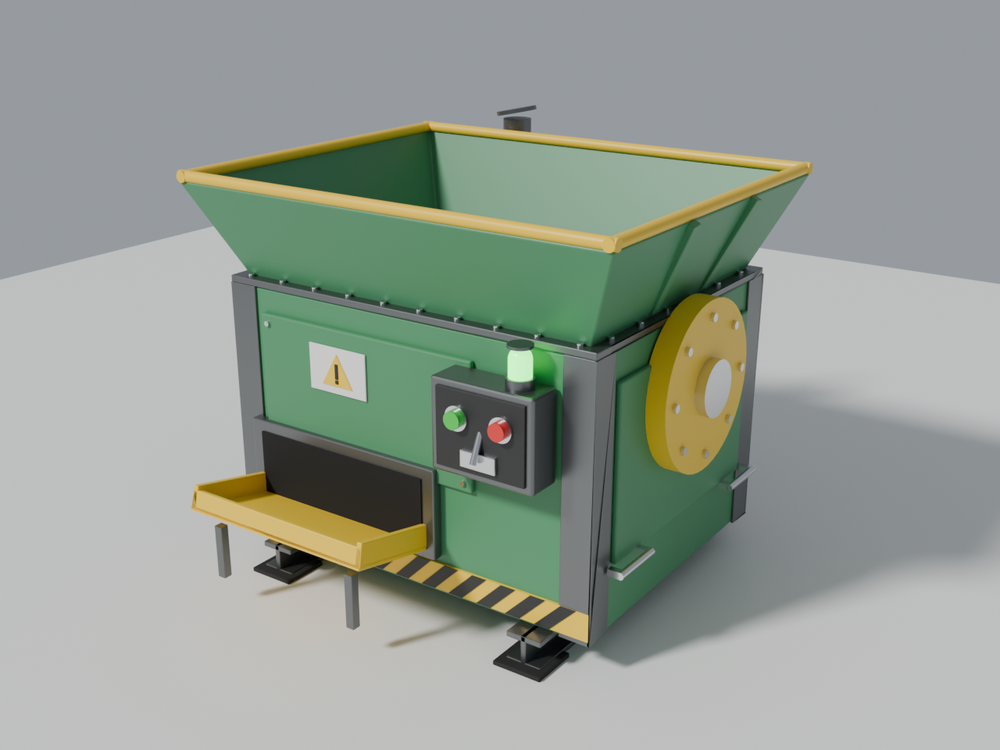
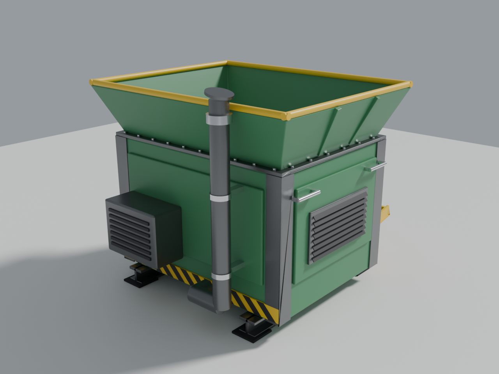

# Recycler model (Rust-style)

Clean, painted recycler: no rust, stains or dirt. Just flat colours, so you can retexture it however you want.

| File | What it is |
|---|---|
| `recycler.fbx` | The model. Import it into Unity, Roblox Studio, Blender, Unreal and so on. |
| `recycler.blend` | Blender source with live (non-applied) bevel/solidify modifiers. |
| `build_recycler.py` | Script that generates both files (`python3 build_recycler.py` with `pip install bpy`, or `blender -b -P build_recycler.py`). |

**Size:** about 1.8 m wide, 1.6 m deep, 1.9 m tall (metres; 1 Blender unit = 1 m). About 5.6k faces.

## Every part is separate

There are 64 named meshes under one `Recycler` root, and each has its own pivot:

- **Base:** `Base_Skid_L/R`, `Base_Crossbar_1/2`, `Base_Foot_*`
- **Body:** `Body_Main`, `Body_Panel_Front/Back/Left/Right`, `Body_CornerGuard_*`, `Body_TopRim`, `Hazard_Band_Yellow`, `Hazard_Stripes_Black`
- **Hopper:** `Hopper`, `Hopper_Lip`, `Hopper_Ribs`
- **Crusher:** `Crusher_Roller_Front/Back` (pivot on the axle, so you can spin them), `Crusher_Axles`, `Crusher_Grate`, `Gear_Cover`, `Gear_Hub`, `Gear_Cover_Bolts`
- **Controls:** `Control_Box`, `Control_Faceplate`, `Button_Start`, `Button_Stop` (each with a `_Collar`), `Lever_Base`, `Lever_Arm`, `Lever_Grip` (pivot at the hinge, so you can rotate it to flip on/off), `Status_Light_Base/Lens/Cap`
- **Output:** `Output_Frame`, `Output_Slot`, `Output_Tray` (pivot at the hinge), `Output_Tray_Legs`
- **Motor/Exhaust:** `Motor_Housing`, `Motor_Vent_Slats`, `Exhaust_Pipe`, `Exhaust_Elbow`, `Exhaust_Collar`, `Exhaust_Brackets`, `Exhaust_RainCap`
- **Details:** `Vent_Frame`, `Vent_Louvers`, `Handle_L1/L2/R1/R2`, `Warning_Plate/Triangle/Mark`, `Bolts_TopRim`, `Bolts_FrontPanel`

Materials are flat colours, one per material: `Paint_Green`, `Paint_Yellow`, `Hazard_Black`, `Steel_Dark`, `Steel_Bright`, `Rubber_Black`, `Button_Red`, `Button_Green`, `Light_Lens` (emissive), `Plate_White`, `Slot_Dark`. Recolour a whole group by changing one material, or give a single part its own. Every mesh has UVs (smart-projected) for when you want to add textures.

To change dimensions or colours for good, edit the constants and `make_mat(...)` calls at the top of `build_recycler.py` and run it again.
