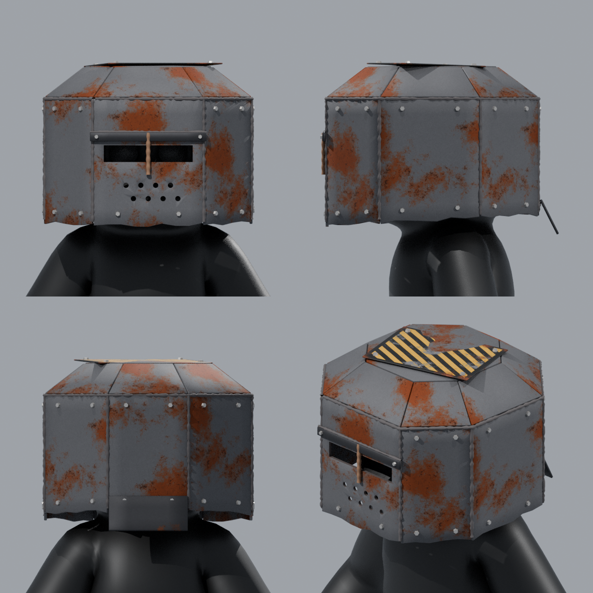

# Scrap Helm for PeeperLeeper

A welded scrap-metal bucket helm in the Rust / Strayed style, built to fit `PeeperLeeper.fbx`.



| File | What it is |
| --- | --- |
| `ScrapHelm.fbx` | The helmet only. Every part is its own object, already positioned for PeeperLeeper (same origin and scale). |
| `PeeperLeeper_ScrapHelm.fbx` | The character with the helmet attached to the `Head` bone, so it moves with the head. |
| `ScrapHelm.blend` | Editable Blender source. Modifiers are still live (thickness, bevel, hole cutouts) and textures are packed. |
| `textures/` | The rust and road-sign textures (512 px). They are also embedded in both FBX files. |
| `build_scrap_helm.py` | The script that generates all of the above. |

## Parts

Each part is a separate object, grouped under empties inside `ScrapHelm`:

- **Wall_Plates**: `Plate_Front` (with the eye slit and breathing holes), `Plate_Front_L/R`, `Plate_Side_L/R`, `Plate_Back_L/R`, `Plate_Back`
- **Lid**: 8 `Chamfer_*` plates and `Lid_Top`
- **Face_Parts**: `Brow_Bar`, `Rebar_Bar`, `Bolt_Brow_L/R`
- **Road_Sign_Parts**: `Road_Sign` and its 4 bolts
- **Neck_Guard_Parts**: `Neck_Guard` and its 2 bolts
- **Welds**: 8 corner welds, `Weld_Lid_Ring`, `Weld_Brow`
- **Bolts**: one object per bolt on the walls

To move or resize the eye slit or the breathing holes, open the `.blend` and edit the wireframe
`Cutter_*` objects in the "Cutters" collection.

Materials: `Scrap_Plate`, `Dark_Steel`, `Road_Sign`, `Weld_Bead`, `Bolt`, `Rebar`.
The helmet is about 15.5k triangles in total.

## Regenerating

The size and shape are set by the numbers at the top of `build_scrap_helm.py` (`HALF` sets the footprint;
`Z_*` sets the heights). After the build, the script prints a fit check confirming that the character
stays at least 6 mm inside the helmet.

```sh
pip install bpy
python build_scrap_helm.py PeeperLeeper.fbx
```
