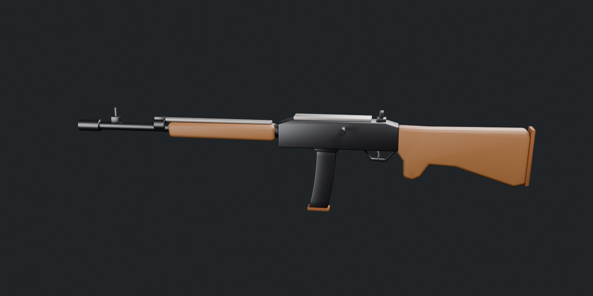

# Semi-Automatic Rifle (Rust SAR / Stray(ed) VR style)



| File | What it is |
| --- | --- |
| `semi_auto_rifle.fbx` | The model. Drop it into Unity, Unreal, Godot, etc. |
| `semi_auto_rifle.blend` | Blender source file |
| `build_rifle.py` | Script that generates both: `pip install bpy && python3 build_rifle.py` |

**Specs:** about 4k triangles, real-world scale in meters (about 1.2 m long), UV-unwrapped. It's a clean,
simple version with no small details like screws, welds, tape or clamps. It has 3 materials: wood, gun steel and
worn/rusty metal.

**Orientation:** the muzzle points forward (+Z in Unity, -Y in Blender) and up is up.

## Hierarchy (built for VR)

```
Rifle_Body    all static parts merged into one mesh
Magazine      pivot at the top of the mag; move it down/out to drop the mag
Bolt          charging handle; slide it backward to rack it
Trigger       pivot on the trigger pin; rotate it on X to pull
```

The file has meshes only, with no empties or markers. If you need attach points, add them in your
engine at these spots (Blender coordinates, in meters):

| Point | Position (x, y, z) |
| --- | --- |
| Right hand grip | 0, 0.17, -0.045 |
| Left hand grip | 0, -0.36, -0.01 |
| Muzzle | 0, -0.765, 0.004 |
| Mag well | 0, -0.08, -0.035 |
| Ejection port | 0.03, -0.06, 0.022 |

The materials are flat colours with no textures. The UVs are there so you can paint rust and wear in
Substance Painter or Blender.
