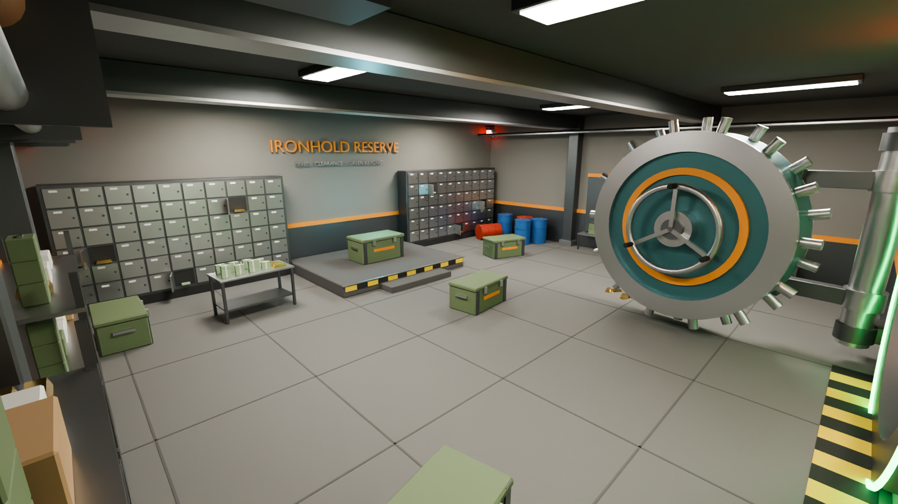

# Ironhold Vaults: Levels 1–3

Loot vault rooms in the style of Strayed VR and Rust. There are three tiers. Each one needs a matching keycard, has a countdown screen showing when it closes again, and holds more loot than the level below.

| Level | Keycard | File | Loot |
| --- | --- | --- | --- |
| 1 | Green | `IronholdVault_L1.fbx` | Military crates, shelves, cash table, 2 rifles, a few gold bars |
| 2 | Blue | `IronholdVault_L2.fbx` | Adds a locked elite crate, a gold pallet, 4 rifles, and more open lockers |
| 3 | Red | `IronholdVault_L3.fbx` | Adds a second gold pallet, a launcher, 6 rifles, and the laser-fenced crystal core |




## Files

- `IronholdVault_L*.fbx` is the main download. It works in Unity, Unreal, Roblox Studio, Godot and Blender.
- `IronholdVault_L*.glb` is the same model as glTF.
- `IronholdVault_L*.blend` is the Blender source scene, with the preview lights and cameras.
- `build_vault.py` is the script that generates everything.

## Specs

- Real-world scale in meters. The room interior is 14 × 12 × 4.5 m, plus a 3.4 m entry tunnel.
- 51k–60k triangles in 44–59 named mesh objects.
- Flat-color PBR materials. The keycard reader, the status-light ring around the door frame, the tunnel sign and the timer screens all glow in the level's keycard color. The UVs are world-scale box projection.
- Moving parts have their pivots set, so they can be animated:
  - `VaultDoor/VaultDoor_Leaf` pivots on its hinge. It is exported open at -97°. Set the rotation to 0 to close it, which you can drive from your open/close timer.
  - The `Locker_OpenDoor*` objects pivot on their own hinges.
- `VaultTimer_In` and `VaultTimer_Out` are the countdown screens. Their digits are modeled as "04:59". In a game, overlay your own live text on the black face.

## Regenerate

```sh
pip install bpy                                 # Blender as a Python module (Python 3.11)
python3 build_vault.py . --level=2 --render     # --render also writes preview PNGs
```
