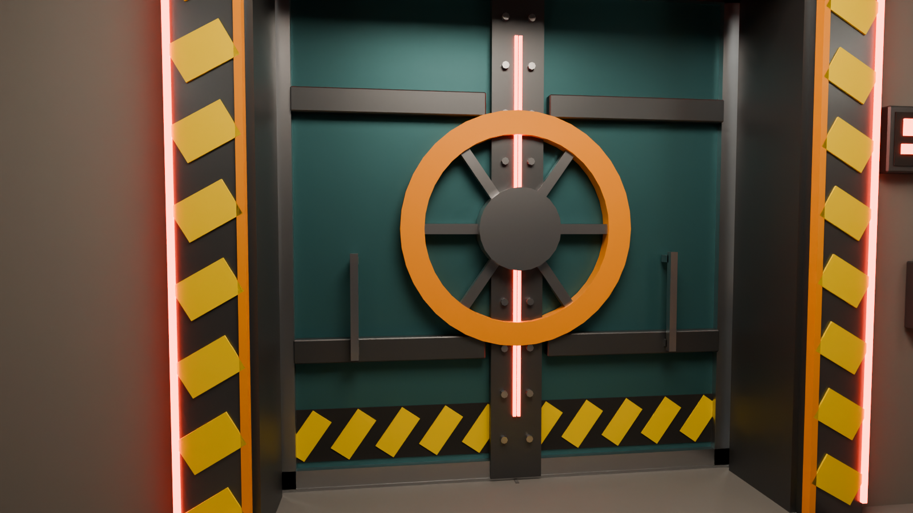
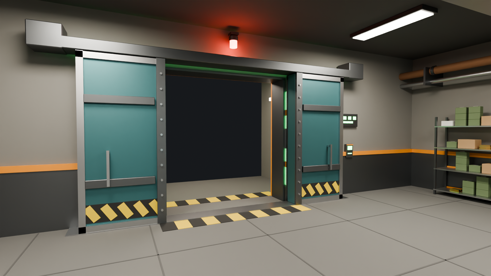
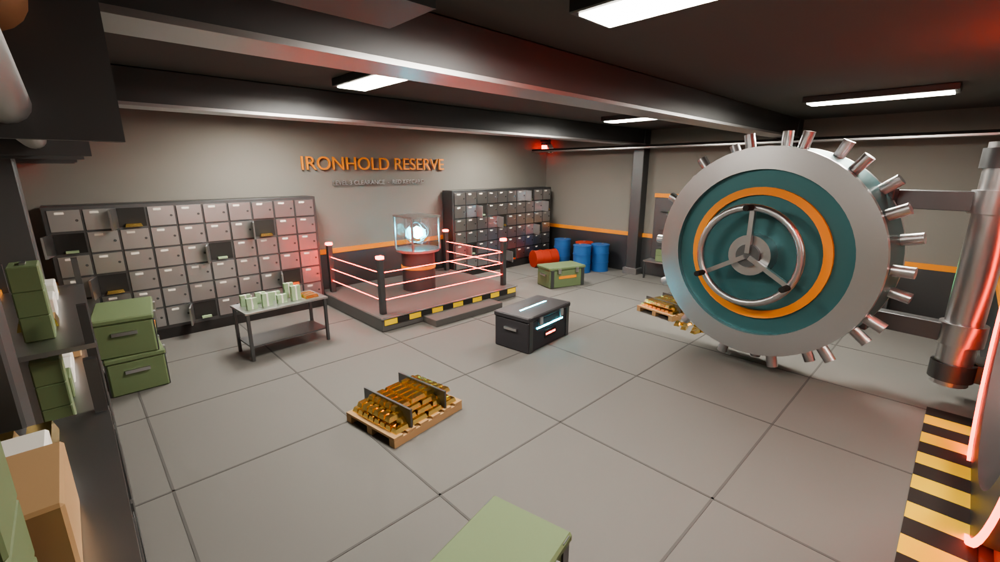

# Ironhold Vaults: Levels 1–3

Loot vault rooms in the style of Strayed VR and Rust. There are three tiers, each opened with a matching keycard. The vault door is two heavy leaves that split down the middle and slide apart, one left and one right. When shut, the halves join into a single lock wheel.

| Level | Keycard | File | Loot |
| --- | --- | --- | --- |
| 1 | Green | `IronholdVault_L1.fbx` | Military crates, one shelf, cash table, 2 rifles |
| 2 | Blue | `IronholdVault_L2.fbx` | Adds a locked elite crate, a gold pallet, 4 rifles |
| 3 | Red | `IronholdVault_L3.fbx` | Adds a second gold pallet, a launcher, 6 rifles, and the laser-fenced crystal core |





## Files

- `IronholdVault_L*.fbx` is the main download. It works in Unity, Unreal, Roblox Studio, Godot and Blender.
- `IronholdVault_L*.glb` is the same model as glTF.
- `IronholdVault_L*.blend` is the Blender source scene, with the preview lights and cameras.
- `build_vault.py` is the script that generates everything.

## Specs

- Real-world scale in meters. The room interior is 14 × 12 × 4.5 m, the doorway is 3.2 × 3.4 m, and the entry tunnel is 3.4 m long.
- 19k–23k triangles in 31–46 named mesh objects. That is light enough for Quest.
- There is no text anywhere in the model. The keycard readers, the door status lights, the track lights and the timer screens glow in the level's keycard color.
- The door is exported open. To animate it:
  - `VaultDoor/VaultDoor_Leaf_L` and `VaultDoor_Leaf_R` slide along the local X axis.
  - Closed positions are X = -0.81 (L) and X = +0.81 (R).
  - Fully open positions are X = -2.47 (L) and X = +2.47 (R). That's 1.66 m of travel each.
- `VaultTimer_In` and `VaultTimer_Out` are blank screens with a glowing bar. Put your own countdown on them in-game.
- The `Locker_OpenDoor*` objects pivot on their own hinges.

## Regenerate

```sh
pip install bpy                                  # Blender as a Python module (Python 3.11)
python3 build_vault.py . --level=2               # add --closed to export with the door shut
python3 build_vault.py . --level=2 --render      # also writes preview PNGs
```
