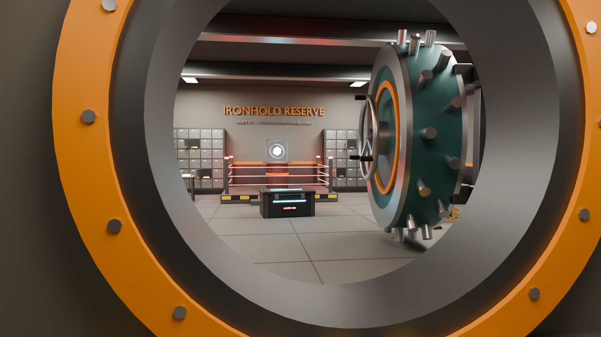
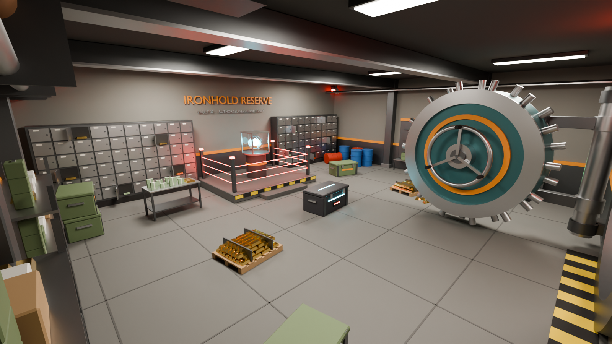

# Ironhold Vault 07

A loot-vault room inspired by Rust and Strayed: a round bank-vault door, a keycard reader, shelves of loot, gold pallets, and a laser-fenced centerpiece.




## Files

| File | Use |
| --- | --- |
| `IronholdVault07.fbx` | Main download: Unity, Unreal, Roblox Studio, Godot, Blender |
| `IronholdVault07.glb` | Same model as glTF, for web, three.js, and Godot |
| `IronholdVault07.blend` | Blender source scene, with preview lights and cameras |
| `build_vault.py` | Script that generates everything. Edit it and re-run it to change the vault |

## Specs

- Real-world scale in meters. The room interior is 14 × 12 × 4.5 m, plus a 3.4 m entry tunnel.
- About 51k triangles in 53 mesh objects, grouped under `IronholdVault07`.
- 28 flat-color PBR materials, including emissive lights, lasers, the core, and the screens. The UVs are world-scale box projection, so tiling textures drop straight on.
- Moving parts have their pivots set, so they can be animated:
  - `VaultDoor/VaultDoor_Leaf` pivots on the hinge axis. It is exported swung open at -97° around the up axis. Set the rotation to 0 to close it.
  - Each `Locker_OpenDoor*` inside `DepositLockers` pivots on its own hinge.
- Separate lootable props: `EliteCrate`, `MilitaryCrate_A–D`, `GoldPallet_A/B`, `CashTable`, the rifles on the `WeaponRack`, `Barrel_0–4`, and the shelf units.

## Regenerate

```sh
pip install bpy                          # Blender as a Python module (Python 3.11)
python3 build_vault.py . --render        # --render also writes the preview PNGs
```

Or use Blender itself: `blender -b -P build_vault.py -- . --render`
